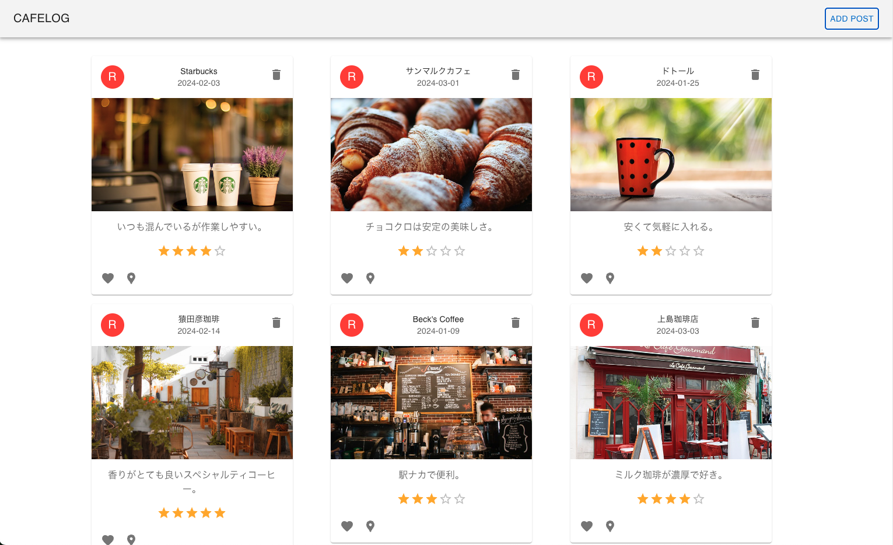

# Cafe Log

### カフェ情報を共有できるアプリ




## 機能
- 投稿表示
  - 名前
  - 評価
  - 写真
  - 訪問日
  - コメント
  - お気に入り
- 投稿作成
- 投稿削除


## 将来の計画

- ログイン
- 投稿
    - 地図表示　
    - 並べ替え機能
    - 検索機能

## Directory structure
```
.
├── build
├── build.gradle.kts
├── front
│   ├── dist
│   ├── eslint.config.js
│   ├── index.html
│   ├── package.json
│   ├── src
│   │   ├── App.css
│   │   ├── App.jsx
│   │   ├── assets
│   │   ├── components
│   │   ├── index.css
│   │   └── main.jsx
│   └── vite.config.js
├── gradle
├── gradlew
├── README.md
├── settings.gradle.kts
└── src
    ├── main
    │   ├── kotlin
    │   └── resources
    └── test
        └── kotlin
```

## 使用技術

* Spring Boot
* React
* Postgres

## 初期セットアップ

```bash
cd front
npm install
npm run dev
```

